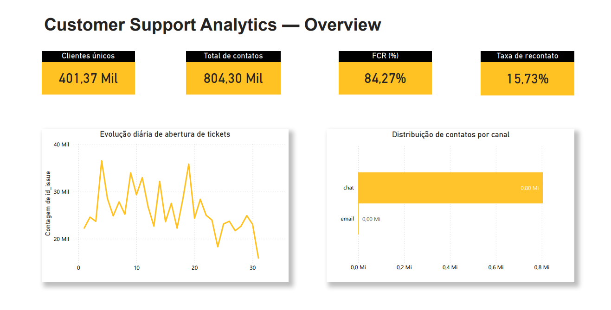
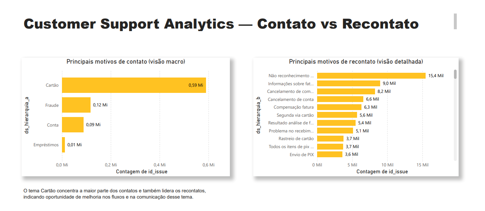
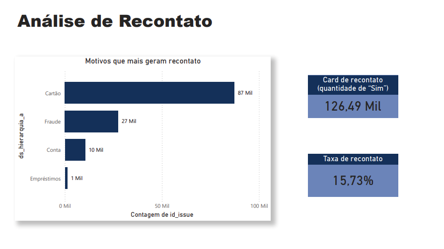
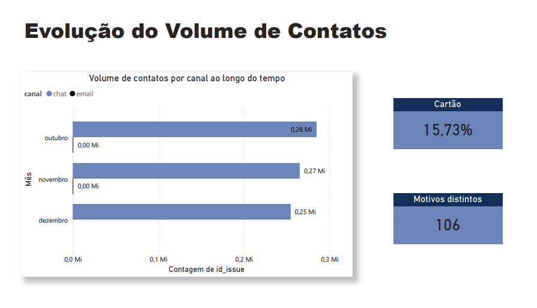
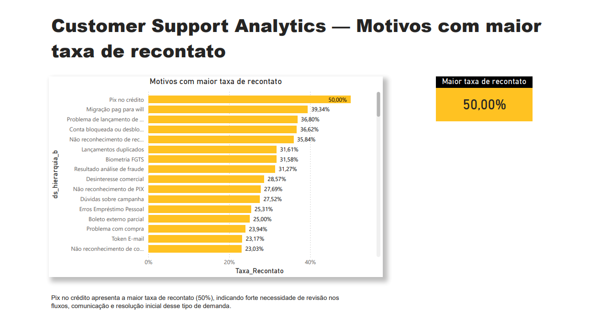

## Customer Support Analytics – Recontact Analysis
Projeto focado na análise de recontato em atendimento ao cliente, com abordagem orientada a dados para melhoria de FCR e eficiência operacional.

## 📊 Resumo Executivo

Este projeto analisa dados de suporte ao cliente com foco na identificação dos principais fatores que impulsionam o recontato e na geração de insights para melhoria da eficiência operacional e da experiência do cliente.

Principais achados:

- Taxa de recontato de 15,73%, indicando oportunidades relevantes de melhoria na resolução no primeiro atendimento (FCR)
- Forte concentração do volume de contatos no canal de chat, sugerindo dependência operacional desse canal
- Demandas relacionadas a cartão concentram o maior volume de contatos e recontatos, indicando possíveis ineficiências na jornada ou falhas na resolução inicial

A análise gera insights acionáveis que podem apoiar a redução de demanda artificial, otimização de processos e aumento da eficiência no atendimento ao cliente.

## 🗂️ Data Source

Os dados utilizados neste projeto são **fictícios e anonimizados**, construídos para simular atendimentos de suporte ao cliente em uma fintech, sem qualquer vínculo com dados reais ou sensíveis.

A base contém informações como:

- id_cliente: identificador único do cliente  
- id_issue: identificador do atendimento  
- canal: canal de atendimento (chat, email)  
- ds_hierarquia_a: categoria macro do motivo  
- ds_hierarquia_b: motivo detalhado do contato  
- dt_data / dt_hora: data e hora do atendimento  
- recontato: indicador se houve novo contato em até 7 dias

## ⚙️ Metodologia

A análise foi conduzida considerando a identificação de recontatos como novos atendimentos realizados pelo mesmo cliente em até 7 dias após o contato inicial.

Etapas realizadas:

- Tratamento e organização dos dados
- Criação de métricas de volume de contatos e clientes únicos
- Cálculo da taxa de recontato (global e por motivo)
- Análise de distribuição por canal
- Identificação dos principais motivos de contato e recontato
- Análise de tendências ao longo do tempo

## 🧠 SQL Analysis

Exemplo de cálculo da taxa de recontato:

```sql
-- cálculo da taxa de recontato por cliente
SELECT
  COUNT(DISTINCT CASE WHEN recontato = 'Sim' THEN id_cliente END) * 1.0
  / COUNT(DISTINCT id_cliente) AS recontact_rate
FROM tabela_atendimentos;

-- volume de contatos por motivo (visão macro)
SELECT
  ds_hierarquia_a AS motivo,
  COUNT(*) AS total_contatos
FROM tabela_atendimentos
GROUP BY ds_hierarquia_a
ORDER BY total_contatos DESC;
```
  
## 📊 Dashboard Overview



## 📌 Contexto
O atendimento apresentou alto volume de contatos concentrado no canal de chat e presença relevante de recontatos, sugerindo falhas de resolução no primeiro atendimento e aumento de custo operacional.

## 🎯 Objetivo
Realizar uma análise diagnóstica para identificar os principais motivos de contato e recontato, mapear padrões e sugerir iniciativas para reduzir demanda artificial e melhorar a experiência do cliente.

## 📊 Métricas analisadas
- Total de contatos
- Clientes únicos
- Contatos por canal e por mês
- Motivos de contato (macro e detalhado)
- Taxa de recontato (global e por motivo)

## 🔍 Contact vs Recontact Analysis


## 📈 Recontact Analysis


## 📊 Contact Volume Trend


## ⚠️ Recontact Drivers


## 🧠 Definição de recontato
Recontato = novo atendimento (novo id_issue) aberto pelo mesmo id_cliente em até 7 dias após o primeiro contato.

## 🔎 Principais insights
- Alto volume de contatos com forte concentração no canal de chat.
- Motivos de **cartão** concentram a maior parte dos contatos e também a maior parte dos recontatos.
- Taxa de recontato de **15,73%** indica demanda artificial relevante e pressão operacional.

## 💡 Recomendações
- Comunicação preventiva ao cliente para reduzir dúvidas recorrentes.
- Aumento do FCR por meio de padronização de scripts e melhoria na base de conhecimento.
- Monitoramento contínuo de recontato por motivo (dashboards de alerta).
- Revisão de fluxos de cartão para atacar causas-raiz.

## 🛠️ Ferramentas
- SQL
- Power BI
- Excel / Google Sheets

## 📌 Conclusão

A análise evidencia que o volume de contatos está fortemente concentrado em temas relacionados a cartão, que também apresentam alta taxa de recontato.

Isso sugere oportunidades claras de melhoria em fluxos operacionais, comunicação com o cliente e resolução no primeiro atendimento (FCR), com potencial direto de redução de demanda e custos operacionais.

A aplicação dessas recomendações pode reduzir a taxa de recontato, melhorar o FCR e diminuir custos operacionais, além de melhorar a experiência do cliente.

> Projeto desenvolvido como estudo de Customer & Business Analytics, utilizando dados simulados para fins educacionais.
> ### 👩‍💻 Autora: Bethina Alvernaz
